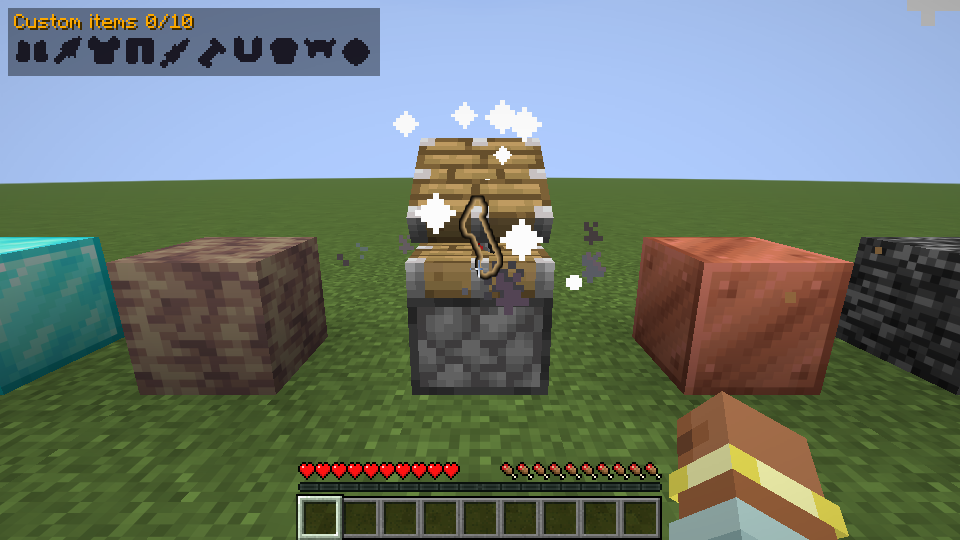
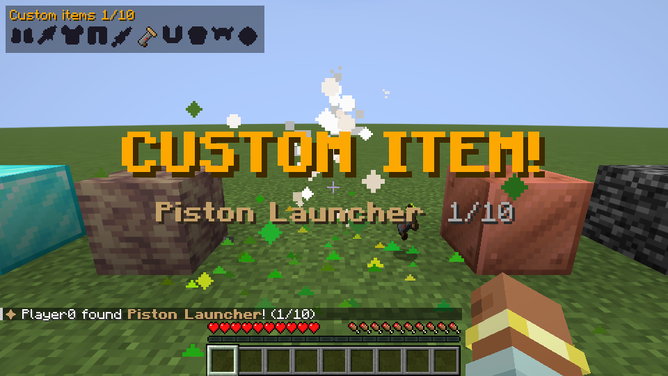
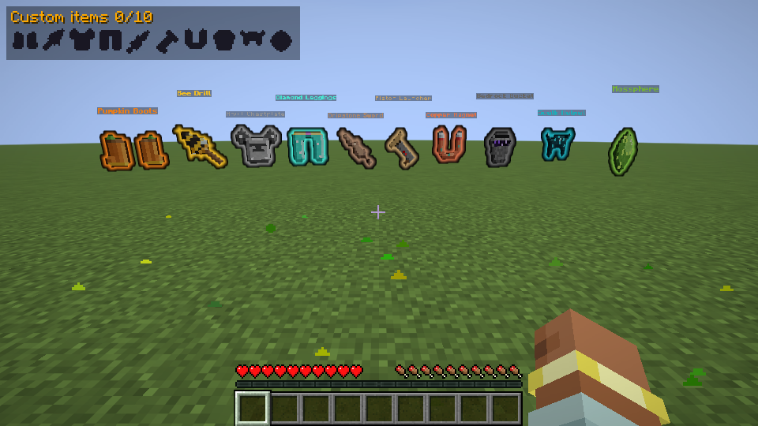
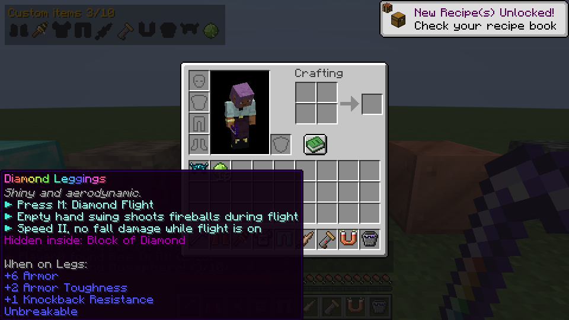
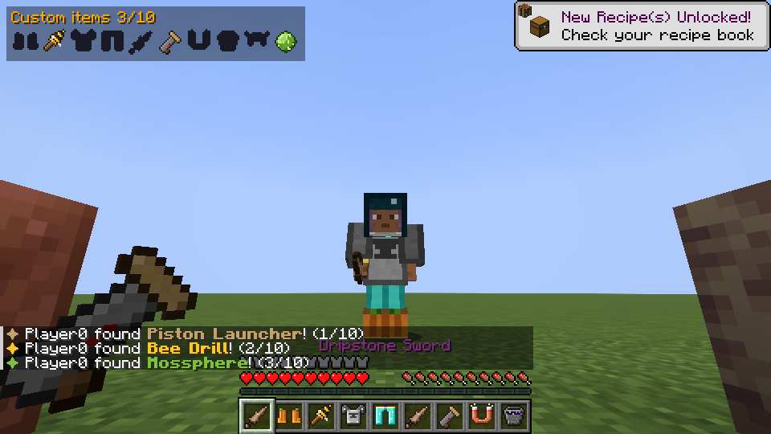
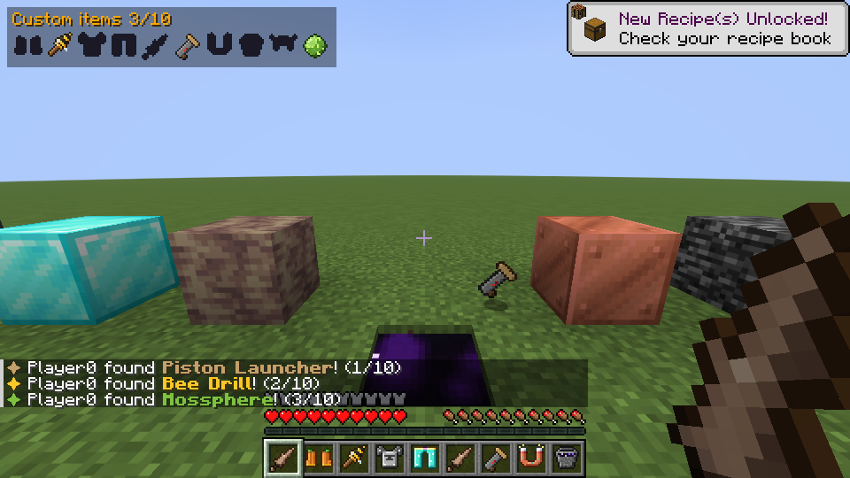
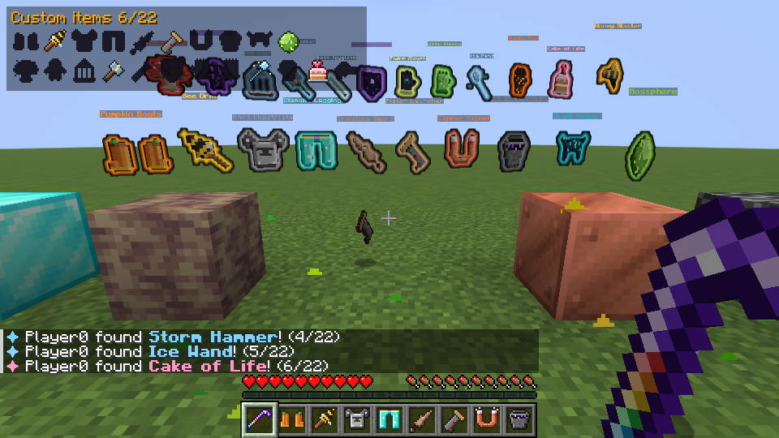
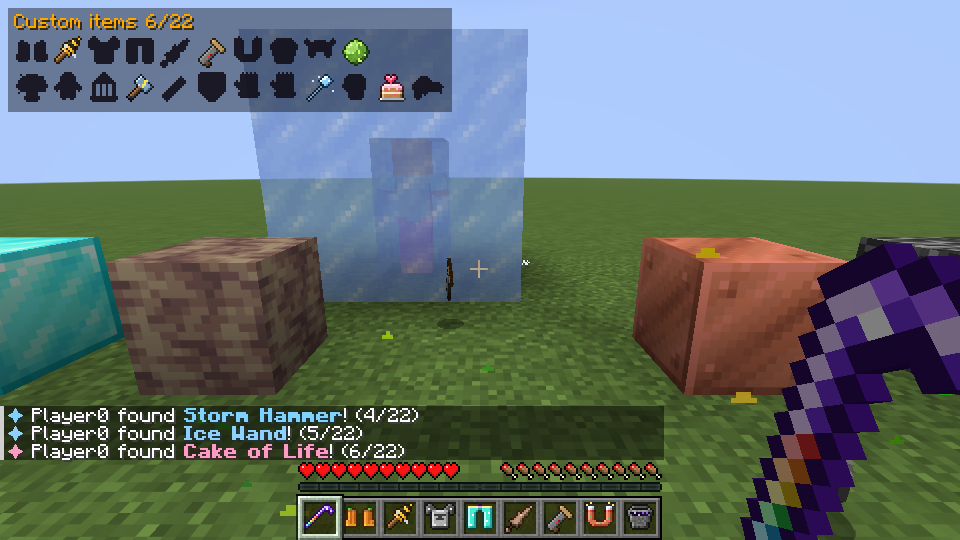

# Block Opener — „Minecraft, But You Can Open Any Block”

Mod Fabric odtwarzający mod z filmu [Henwy – *Minecraft, But You Can Open Any Block*](https://youtu.be/D1C58JjXpww)
(mod oryginalnie od Grasera). Każdy blok da się otworzyć **Otwieraczem Bloków**: większość ma w środku trochę
żelaza, rudy chowają łup ze skrzyń ze struktur, a **10 sekretnych bloków** ma w środku OP customowe przedmioty.

- Minecraft **1.21.11**, Fabric Loader **0.19.5+**, **Fabric API** (wymagane na serwerze i u graczy)
- Wszystkie tekstury są autorskie (pixel art generowany skryptem `tools/generate_textures.py`)
- Język gry: angielski i polski

| | |
|---|---|
|  |  |
|  |  |
|  |  |
|  |  |

*(screenshoty robi automatycznie `./gradlew runClientGameTest`)*

## Otwieranie bloków

Weź Otwieracz Bloków (`/bo give`) i kliknij PPM dowolny blok. Tłok podnosi „wieko”, łup wyskakuje z góry,
a sekretny przedmiot najpierw unosi się, kręci i świeci. Pierwsze znalezienie każdego z 10 przedmiotów daje
tytuł na ekranie, dźwięk, wiadomość na czacie i zapala się ikonka w trackerze (lewy górny róg, klawisz **J**).

- **Kucnięcie + PPM** – normalne użycie bloku (skrzynia, stół rzemieślniczy…) z Otwieraczem w ręce.
- Skrzynie wysypują swoją zawartość, bloki zalane wodą zostawiają wodę.
- Nie da się otworzyć bloków technicznych, portali i ramki portalu Endu (żeby nie zablokować przejścia gry).
  Bedrock **da się** otworzyć (jak w filmie).

| Blok | Co jest w środku |
|---|---|
| Większość bloków | żelazo, czasem węgiel / złoto / nić / pochodnie / strzały |
| Ruda węgla | domek z wioski (dużo drewna) + szansa na złote jabłko |
| Ruda miedzi | skrzynia rybaka + domek z wioski (jedzenie!) |
| Ruda żelaza | kowal broni z wioski |
| Ruda złota | nagroda z komnat prób (wind charge, tarcza…) |
| Ruda redstone | korytarz twierdzy + perły Endu, obsydian, szmaragdy |
| Ruda lapis | skarb z wraku albo „diamentowy” łup |
| Ruda diamentów | zrujnowany portal / skarb bastionu, czasem perły Endu |
| Ruda szmaragdów | piramida pustynna |
| Blok żelaza / złota | 1 sztabka żelaza / 1 węgiel (żart z filmu) |
| Bloki robocze wieśniaków | skrzynia z ich domu: piec hutniczy = płatnerz, szlifierka = kowal broni, stół kowalski = narzędziowiec, stół łuczarza = łuczarz, stół kartografa = kartograf, wędzarnia = rzeźnik, krosno = pasterz, kocioł = garbarz, statyw alchemiczny = świątynia, kompostownik = domek, beczka = rybak, pulpit = biblioteka twierdzy |
| Stół do zaklinania | losowo zaklęta książka + lapis |
| Blok szmaragdów | szmaragdy + 30% na jajo wieśniaka |
| Liście | jak zwykły blok + 25% na jabłko |

## 10 sekretnych przedmiotów

| # | Blok | Przedmiot | Moce |
|---|---|---|---|
| 1 | Dynia | **Dyniowe Buty** | sprint = ślad wybuchowych dyń; kucanie 3 s = zamiana w dynię (moby tracą cel) |
| 2 | Ul / gniazdo pszczół | **Pszczele Wiertło** | PPM = przywołaj pszczoły; PPM na moba (także z daleka) = pszczoły atakują; bronią cię i nie tracą żądła |
| 3 | Kowadło | **Kowadłowy Napierśnik** | skok + kucnięcie = wybuchowe uderzenie, które **otwiera wszystkie bloki dookoła** (deszcz łupu, szybkie kopanie w dół); kucanie = Odporność + spowolnienie |
| 4 | Blok diamentów | **Diamentowe Spodnie** | **M** = Diamentowy Lot; machnięcie pustą ręką w locie = kule ognia; Szybkość II |
| 5 | Blok nacieku | **Naciekowy Miecz** | 9 obrażeń; kucnięcie + atak = Deszcz Stalaktytów; PPM = deszcz tam, gdzie patrzysz |
| 6 | Tłok | **Tłokowa Wyrzutnia** | kucnięcie + PPM = turbo wystrzał; PPM na moba = mega kopniak (wybucha przy uderzeniu); PPM = działo z TNT |
| 7 | Blok miedzi | **Miedziany Magnes** | w ręce przyciąga przedmioty; PPM = rozbrojenie wszystkich w okolicy; kucanie = turbo przyciąganie |
| 8 | Bedrock | **Wiadro z Bedrocka** | nieskończona Woda Pustki (pożera przedmioty, rani przez zbroję); kucnięcie + PPM = wypompowanie |
| 9 | Wrzeszczak / katalizator sculk | **Sculkowy Hełm** | **G** = Sonic Boom Wardena (przez ściany); odporność na Ciemność; czujniki sculk cię nie słyszą |
| 10 | Blok mchu | **Mchowa Kula** | rzucana, zabija wszystko, w co trafi (smoka też!); tam, gdzie spadnie, rośnie mech |

## Tryb rozszerzony: +12 przedmiotów (razem 22)

Włączasz jedną komendą: **`/bo settings extendedItems true`** (wyłączasz `false`, zapisuje się w świecie).
Tracker dostaje drugi rząd, licznik idzie do 22, a `testrow` / `showcase` pokazują wszystko.
`/bo give @s all` zawsze daje wszystkie 22 przedmioty.

| # | Blok | Przedmiot | Moce |
|---|---|---|---|
| 11 | Bloki grzybów | **Grzyb Rozmiaru** | PPM = olbrzym (x3: zasięg, obrażenia, przechodzisz przez murki); kucnięcie + PPM = maluch (dziury 1x1, moby cię gubią); drugi raz = normalny rozmiar |
| 12 | Płaczący obsydian | **Płaczący Totem** | działa z ekwipunku; raz oszukuje śmierć (także w próżni) i przenosi na ostatni pewny grunt |
| 13 | Spawner / spawner prób | **Klatka na Moby** | PPM na moba = złap (nawet Wardena); PPM na blok = wypuść jako sojusznika, który bije to, co ty |
| 14 | Piorunochron | **Młot Burzy** | PPM = piorun tam, gdzie patrzysz; atak z wyskoku = pierścień piorunów; twoja burza cię nie rani |
| 15 | Szkło | **Szklana Luneta** | patrząc przez nią widzisz rudy i bloki z brakującymi przedmiotami przez ściany |
| 16 | Obsydian | **Obsydianowa Tarcza** | blokuje ciosy z każdej strony, nie psuje się; kucnięcie + PPM = kopuła z obsydianu na 10 s |
| 17 | Kamień Endu | **Rękawice Endu** | PPM = teleport do 64 bloków; PPM na moba = zamiana miejscami; Endermani cię ignorują |
| 18 | Blok szlamu | **Szlamowe Rękawice** | PPM = super skok; kucnięcie + PPM = platforma ze szlamu; w ręce zero obrażeń od upadku (odbijasz się) |
| 19 | Niebieski / zbity lód | **Lodowa Różdżka** | PPM = zamraża moba w bryle lodu na 5 s; w ręce woda zamarza pod stopami |
| 20 | Blok magmy | **Magmowa Pięść** | każdy cios podpala; PPM = ognista fala; w ręce odporność na ogień i chodzenie po lawie |
| 21 | Tort (też ze świeczką) | **Tort Życia** | leczy i syci, nigdy się nie kończy (8 s odnowienia) |
| 22 | Blok miodu | **Miodowy Blaster** | strzały miodem przyklejają moby; kucnięcie + PPM = salwa 5 strzałów; zostawia bloki miodu |

Bloki tworzone przez moce (kopuła, platforma, lód, skorupa na lawie, miód) znikają same, nic z nich nie
wypada i nie da się ich otworzyć, więc nie da się nimi farmić przedmiotów.

Własne wybuchy nigdy nie ranią właściciela. Jak zwykłe TNT niszczą leżące przedmioty (wyłączysz: `/bo settings explosionsDestroyItems false`); wyjątkiem jest uderzenie kowadła, które zostawia łup z otwartych bloków. Customowe przedmioty są niezniszczalne.
Moce w tooltipie są ukryte pod „Przytrzymaj SHIFT”, żeby nie spoilerować na nagraniu.

## Klawisze (do zmiany w Opcje → Sterowanie → Block Opener)

| Klawisz | Akcja |
|---|---|
| **M** | Diamentowy Lot (w Diamentowych Spodniach) |
| **G** | Sonic Boom (w Sculkowym Hełmie) |
| **J** | pokaż / ukryj tracker przedmiotów |

## Komendy do nagrywania (`/bo` = `/blockopener`)

| Komenda | Po co |
|---|---|
| `/bo give [gracze] [opener\|all\|<przedmiot>]` | daje Otwieracz, wszystko albo jeden przedmiot |
| `/bo reset [gracze]` | zeruje znalezione przedmioty – szybki dubel ujęcia |
| `/bo complete [gracze]` | oznacza wszystkie przedmioty jako znalezione (pełny tracker) |
| `/bo reveal <gracz> <przedmiot>` | odgrywa moment „CUSTOMOWY PRZEDMIOT!” i daje przedmiot |
| `/bo timer start <min> [sek]`, `pause`, `stop`, `add <sek>` | boss bar z odliczaniem (np. „20 minut, potem walka”) |
| `/bo locate <przedmiot>` | podświetla przez ściany najbliższy blok z tym przedmiotem (klik w koordy = /tp) |
| `/bo testrow` | stawia przed tobą rząd sekretnych bloków (w trybie rozszerzonym 2 rzędy) |
| `/bo showcase [sekundy]`, `/bo showcase clear` | przedmioty lewitują i kręcą się przed tobą (ujęcie jak intro filmu) |
| `/bo hud [true\|false] [gracze]` | tracker dla wybranych graczy |
| `/bo progress [gracz]` | lista znalezionych przedmiotów |
| `/bo open <x y z>` | otwiera blok komendą (np. z bloku poleceń do cinematiców) |
| `/bo settings …` | `explosionsBreakBlocks`, `explosionsDestroyItems`, `announceFinds`, `lootRolls` (1-16, więcej łupu), `openCooldown`, `extendedItems` (+12 przedmiotów) |

## Dostosowanie

Zawartość bloków to zwykłe tabele łupu: `data/blockopener/loot_table/opening/<namespace>/<blok>.json`
(domyślna: `opening/default.json`). W trybie rozszerzonym pierwszeństwo mają `opening_extended/<namespace>/<blok>.json`. Datapackiem możesz zmienić, co jest w dowolnym bloku, albo ukryć
sekretny przedmiot w innym bloku. Bloki, których nie da się otworzyć: tag `blockopener:unopenable`.

## Budowanie

Gradle / Loom 1.18 wymaga **Javy 25** do uruchomienia builda (sam mod jest kompilowany pod Javę 21).

```bash
./gradlew build              # jar: build/libs/blockopener-1.21.11-1.0.0.jar, odpala też testy serwerowe
./gradlew runClient          # gra z modem
./gradlew runClientGameTest  # test klienta, robi screenshoty scen do build/run/clientGameTest/screenshots
python3 tools/generate_textures.py && python3 tools/generate_data.py   # przegenerowanie zasobów
```
