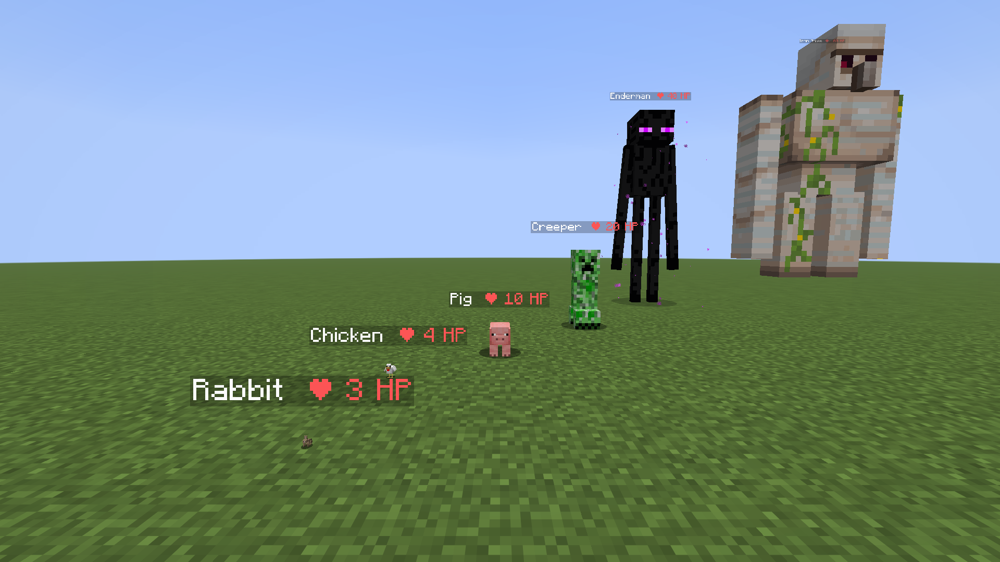

# HP Size — moby są tak duże, jak dużo mają życia

Mod Fabric na **Minecraft 1.21.11** zrobiony na podstawie filmu
[„Minecraft, but Mobs are as big as their health”](https://youtu.be/75mSpDQvTHo) (stuhpy).
Rozmiar każdego moba zależy od tego, ile naturalnie ma HP. Mob z 20 HP (tyle co gracz) ma normalny rozmiar,
słabsze moby są mniejsze, silniejsze — większe. Każde uderzenie zmniejsza moba, leczenie go powiększa.

| Mob | HP | Rozmiar |
|---|---|---|
| królik, ryby | 3 | ×0,15 (malutki) |
| kurczak | 4 | ×0,2 |
| nietoperz | 6 | ×0,3 |
| owca, rybik cukrowy, wilk (dziki) | 8 | ×0,4 |
| krowa, świnia, pszczoła | 10 | ×0,5 |
| pająk | 16 | ×0,8 |
| zombie, szkielet, creeper, osadnik | 20 | ×1 (normalny) |
| enderman, hoglin | 40 | ×2 |
| piglin brute | 50 | ×2,5 |
| strażnik prastary | 80 | ×4 |
| żelazny golem, niszczyciel (ravager) | 100 | ×5 |
| Wither | 300 | ×15 |
| Warden | 500 | ×16 (limit gry; maleje dopiero poniżej 320 HP) |
| Ender Dragon | 200 | ×8 (osobne ustawienie `/hpsize dragon`, maleje razem z HP) |

Do tego komendy, które ułatwiają nagrywanie odcinka i poprawiają film dla widza.

Komunikaty moda są po polsku, gdy grasz w polskiej wersji językowej, a po angielsku dla pozostałych graczy
i w konsoli serwera (działa to także u graczy bez moda).

> **Wskazówka do nagrywania:** gra przestaje rysować malutkie moby już kilka bloków dalej (zasięg zależy od wielkości
> hitboxa). Ustaw w Ustawieniach graficznych **Odl. renderow. bytów** na 500%, a króliki i kurczaki
> będą widoczne 5× dalej. Pomaga też `/hpsize glowtiny on`.

## Instalacja

1. Zainstaluj [Fabric Loader](https://fabricmc.net/use/installer/) dla 1.21.11 (0.17.3 lub nowszy).
2. Wrzuć do folderu `mods`:
   - `hpsize-1.0.0+1.21.11.jar` (ten mod),
   - [Fabric API](https://modrinth.com/mod/fabric-api) dla 1.21.11.
3. W świecie potrzebujesz uprawnień do komend (singleplayer: „Zezwól na kody” / Otwórz dla LAN → kody włączone).

Mod działa też na serwerze. Gracze bez moda mogą wejść (widzą giganty i odliczania),
a klawisz czystego HUD działa tylko u osób, które mają moda u siebie.

## Mechanika z filmu — `/hpsize`

| Komenda | Co robi |
|---|---|
| `/hpsize` | pokazuje wszystkie ustawienia |
| `/hpsize on` / `off` | włącza / wyłącza mechanikę (po wyłączeniu wszystko wraca do normy) |
| `/hpsize preset film` | **dokładnie jak w filmie**: rozmiar według HP (20 HP = normalny), zmiana natychmiastowa |
| `/hpsize preset smooth` | jak w filmie, ale moby płynnie „oklapują” po ciosie (domyślne) |
| `/hpsize preset fair` | każdy cios zmniejsza moba — także Wardena, który normalnie przez pierwsze 180 HP stoi na limicie ×16 |
| `/hpsize preset light` | mniejsze różnice: maluchy nie tak malutkie, giganci maks. ×6 — mniej lagów |
| `/hpsize mode health\|max\|percent\|sqrt` | według: aktualnego HP / maks. HP (nie maleje) / maks. HP i % życia / pierwiastka z HP |
| `/hpsize normal <hp>` | przy ilu HP mob ma normalny rozmiar (domyślnie 20, tyle co gracz) |
| `/hpsize min <x>` / `max <x>` | najmniejszy / największy rozmiar (0.0625–16) |
| `/hpsize dragon <rozmiar>` | rozmiar Ender Dragona przy pełnym HP (domyślnie ×8; maleje razem z HP) |
| `/hpsize smooth <0-100>` | płynność zmian (0 = natychmiast) |
| `/hpsize players on\|off` | czy gracze też zmieniają rozmiar (pomysł na kolejny odcinek!) |
| `/hpsize suffocation on\|off` | czy giganci duszą się w blokach (w filmie przez to malały w jaskiniach) |
| `/hpsize exclude <mob>` / `include <mob>` | mob zachowa normalny rozmiar (np. `minecraft:enderman` na walkę ze smokiem) |
| `/hpsize freeze` / `unfreeze` | zamraża rozmiary (ujęcie bez zmian) |
| `/hpsize glowtiny on\|off`, `/hpsize glowtiny below <x>` | podświetla malutkie moby (w filmie ginęły z oczu) |
| `/hpsize sound on\|off` | dźwięk „sflaczenia” (jak rybka rozdymka), gdy cios zmniejsza moba — grubszy dla gigantów, piskliwy dla maluchów |
| `/hpsize info [cele]` | pisze na czacie HP i rozmiar moba, na którego patrzysz (tylko dla Ciebie) |
| `/hpsize reset` | ustawienia domyślne |

Ustawienia zapisują się w folderze świata (`hpsize.json`). Rozmiar nie jest zapisywany w mobach,
więc po wyłączeniu lub odinstalowaniu moda świat wraca do normy. Stojaki na zbroję są domyślnie wykluczone.
Zwykła gra zawsze trzyma Ender Dragona w normalnym rozmiarze, więc mod skaluje jego model i hitbox sam;
powiększonego smoka widzą gracze, którzy mają moda u siebie.

## Komendy do ustawiania ujęć z mobami

| Komenda | Co robi |
|---|---|
| `/spawnsized <mob> <hp> [ilość]` | przywołuje moba z danym HP, czyli od razu w danym rozmiarze, np. `/spawnsized minecraft:chicken 200` (kurczak ×10) |
| `/mobhp <cele> <hp>` | ustawia HP (a więc rozmiar), np. żeby zmniejszyć piglina do handlu bez bicia |
| `/mobhp <cele> max <hp>` | ustawia maks. HP i leczy do pełna |
| `/heal [cele]` | leczy graczy (też głód) lub moby — moby wracają do pełnego rozmiaru |
| `/glow <cele> [sekundy]` | podświetla moby (0 = wyłącz) |
| `/mute <cele>` / `/unmute <cele>` | wycisza moby (np. hałaśliwe pigliny przy handlu) |

## Komendy do nagrywania

| Komenda | Co robi |
|---|---|
| `/go [sekundy] [tekst]` | start odcinka: zamraża graczy → odliczanie → START → odmraża (np. `/go 5 &aPowodzenia!`) |
| `/countdown <sekundy> [tekst]` | odliczanie na środku ekranu z dźwiękiem; `/countdown cancel` |
| `/freeze [gracze]` / `/unfreeze [gracze]` | zatrzymuje graczy w miejscu (mogą się rozglądać) |
| `/announce <tytuł>[\|podtytuł]` | duży napis na ekranie dla wszystkich, np. `/announce &6Rozdział 2\|Nether` |
| `/recmode on` / `off` | ukrywa na czacie komunikaty komend, potwierdzenia lecą na pasek akcji |
| `/cam` | tryb kamerzysty (widz); drugie `/cam` wraca na to samo miejsce i w ten sam tryb |
| `/nv [gracze]` | noktowizja bez cząsteczek (w filmie było za ciemno w Netherze) |
| `/cleanup [items\|mobs\|all] [promień]` | usuwa leżące przedmioty/strzały/XP lub wrogie moby — mniej lagów przy gigantach |

## Po stronie klienta (jeśli masz moda u siebie)

| Klawisz / komenda | Co robi |
|---|---|
| `H` | **czysty HUD**: chowa serca, pasek przedmiotów, celownik itp., ale zostawia rękę, czat i napisy na ekranie (inaczej niż F1) |
| `/hud on\|off`, `/hud hide <element>`, `/hud show <element>`, `/hud list` | wybór elementów ukrywanych przez czysty HUD |

Klawisz zmienisz w Opcje → Sterowanie → HP Size. Zoom celowo nie jest częścią moda — używaj swojego moda do zoomu.

## Modrinth

Wszystko do wgrania moda na Modrinth jest w folderze [`modrinth/`](modrinth/): opis, krótkie podsumowanie, ikona,
zrzuty do galerii, lista zmian i instrukcja krok po kroku ([`modrinth/UPLOAD.md`](modrinth/UPLOAD.md)).

## Budowanie

Gotowy plik `.jar` buduje GitHub Actions (zakładka **Actions** → workflow `hpsize` → artefakt `hpsize-mod`).
Lokalnie: JDK 25 i `./gradlew build` w folderze `hpsize` (plik w `build/libs/`).

Testy automatyczne (`src/gametest`) sprawdzają mechanikę i komendy na serwerze, a w CI uruchamiają
też prawdziwego klienta Minecrafta, który robi zrzuty ekranu (artefakt `client-test-screenshots`).
