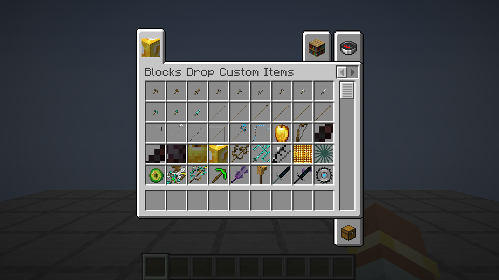

# RecKit — baza przedmiotów do filmów

Mod Fabric na **Minecraft 1.21.11**: biblioteka customowych przedmiotów wyciągniętych z datapacków i paczek tekstur.
Z każdej paczki bierzemy **tylko przedmioty** (tekstury, modele, nazwy) — bez mechanik, crafingów i trybu gry.
Każdy przedmiot to zwykły rekwizyt: można go trzymać w ręce, położyć w ramce, wyrzucić, ale nic nie robi.

## Instalacja

1. Zainstaluj [Fabric Loader](https://fabricmc.net/use/installer/) dla 1.21.11 (0.17.3 lub nowszy).
2. Wrzuć do folderu `mods`:
   - `reckit-1.21.11-1.0.0.jar` (ten mod),
   - [Fabric API](https://modrinth.com/mod/fabric-api) dla 1.21.11.

Na serwerze mod musi być **na serwerze i u wszystkich graczy** (przedmioty są zarejestrowane, nie podmieniają vanilli).

## Użycie

- **Tryb kreatywny**: każda paczka ma swoją zakładkę w ekwipunku kreatywnym (strzałki na górze, jeśli zakładek jest dużo).
  Przedmioty znajdziesz też w wyszukiwarce.
- **Komenda**: `/give @s reckit:<id>`, np. `/give @s reckit:ruby_sword` (Tab podpowiada nazwy).

## Przedmioty

Lista generowana przez `tools/import_pack.py` z plików w `sources/`. Podgląd każdego przedmiotu w ręce (pierwsza i trzecia
osoba): [Bloki dropią customowe itemy](docs/blocks_drop_custom_items.png), [Głupie pomysły](docs/dumb_ideas.png).



<!-- items:start -->
### Bloki dropią customowe itemy

Źródło: [Minecraft, but Blocks Drop Custom Items!](https://www.planetminecraft.com/data-pack/minecraft-but-blocks-drop-custom-items/) (Diamond dev, Minecraft 1.20.4).

| Przedmiot | Komenda |
|---|---|
| Malutki drewniany kilof | `/give @s reckit:tiny_wooden_pickaxe` |
| Malutka drewniana siekiera | `/give @s reckit:tiny_wooden_axe` |
| Malutki drewniany miecz | `/give @s reckit:tiny_wooden_sword` |
| Malutki kamienny kilof | `/give @s reckit:tiny_stone_pickaxe` |
| Malutka kamienna siekiera | `/give @s reckit:tiny_stone_axe` |
| Malutki kamienny miecz | `/give @s reckit:tiny_stone_sword` |
| Malutki żelazny kilof | `/give @s reckit:tiny_iron_pickaxe` |
| Malutka żelazna siekiera | `/give @s reckit:tiny_iron_axe` |
| Malutki żelazny miecz | `/give @s reckit:tiny_iron_sword` |
| Malutki diamentowy kilof | `/give @s reckit:tiny_diamond_pickaxe` |
| Malutka diamentowa siekiera | `/give @s reckit:tiny_diamond_axe` |
| Malutki diamentowy miecz | `/give @s reckit:tiny_diamond_sword` |
| Długi drewniany kilof | `/give @s reckit:long_wooden_pickaxe` |
| Długa drewniana siekiera | `/give @s reckit:long_wooden_axe` |
| Długi drewniany miecz | `/give @s reckit:long_wooden_sword` |
| Długi kamienny kilof | `/give @s reckit:long_stone_pickaxe` |
| Długa kamienna siekiera | `/give @s reckit:long_stone_axe` |
| Długi kamienny miecz | `/give @s reckit:long_stone_sword` |
| Długi żelazny kilof | `/give @s reckit:long_iron_pickaxe` |
| Długa żelazna siekiera | `/give @s reckit:long_iron_axe` |
| Długi żelazny miecz | `/give @s reckit:long_iron_sword` |
| Długi diamentowy kilof | `/give @s reckit:long_diamond_pickaxe` |
| Długa diamentowa siekiera | `/give @s reckit:long_diamond_axe` |
| Długi diamentowy miecz | `/give @s reckit:long_diamond_sword` |
| Długie złote jabłko | `/give @s reckit:long_golden_apple` |
| Długi łuk | `/give @s reckit:long_bow` |
| Gigantyczny netherytowy kilof | `/give @s reckit:giant_netherite_pickaxe` |
| Gigantyczna netherytowa siekiera | `/give @s reckit:giant_netherite_axe` |
| Gigantyczny netherytowy miecz | `/give @s reckit:giant_netherite_sword` |
| Gigantyczne złote jabłko | `/give @s reckit:giant_golden_apple` |
| Gigantyczny Lucky Block | `/give @s reckit:giant_lucky_block` |
| Super kilof | `/give @s reckit:super_pickaxe` |
| Miecz Miecz Miecz | `/give @s reckit:sword_sword_sword` |
| Ekstremalny łuk | `/give @s reckit:extreme_bow` |
| Super złote jabłko | `/give @s reckit:super_golden_apple` |
| Super trójząb | `/give @s reckit:super_trident` |
| Oko Boga | `/give @s reckit:eye_of_god` |
| Multinarzędzie | `/give @s reckit:multi_tool` |
| Kilof X3 | `/give @s reckit:pickaxe_x3` |
| Szmaragdowy kilof | `/give @s reckit:emerald_pickaxe` |
| Ametystowy miecz | `/give @s reckit:amethyst_sword` |
| Wielbłądzi miecz | `/give @s reckit:camel_sword` |
| Sculkowy miecz | `/give @s reckit:sculk_sword` |
| Sculkowy miecz (wariant) | `/give @s reckit:sculk_sword_2` |
| Tarcza-piła | `/give @s reckit:sawblade_shield` |
| Wielbłądzia bomba | `/give @s reckit:camel_bomb` |
| Diamentowa świątynia | `/give @s reckit:diamond_temple` |
| Biblioteka | `/give @s reckit:library` |
| Świątynia sniffera | `/give @s reckit:sniffer_temple` |
| Wiśniowy staw | `/give @s reckit:cherry_pond` |
| Bambusowa chatka | `/give @s reckit:bamboo_hut` |

### Głupie pomysły

Źródło: [I added YOUR DUMB IDEAS to Minecraft...](https://www.planetminecraft.com/data-pack/i-added-your-dumb-ideas-to-minecraft/) (Diamond_dev, Minecraft 1.18).

| Przedmiot | Komenda |
|---|---|
| Rageblade | `/give @s reckit:rageblade` |
| Odłamek Rageblade | `/give @s reckit:rageblade_fragment` |
| Wysoka ręka | `/give @s reckit:tall_hand` |
| Strzała wzrostu | `/give @s reckit:grow_arrow` |
| Strzała zmniejszania | `/give @s reckit:shrink_arrow` |
| Lamia głowa | `/give @s reckit:llama_helmet` |
| Plucie lamy | `/give @s reckit:llama_spit` |
| Laska wody | `/give @s reckit:water_staff` |
| Kurzy placek | `/give @s reckit:chicken_pie` |
| Multinarzędzie | `/give @s reckit:small_multi_tool` |
| Globus | `/give @s reckit:globe` |
| Lammy | `/give @s reckit:lammy` |
| Napakowany kurczak | `/give @s reckit:buff_chick` |
| Czarny diament | `/give @s reckit:black_diamond` |
| Czarny diamentowy miecz | `/give @s reckit:black_diamond_sword` |
| Czarny diamentowy kilof | `/give @s reckit:black_diamond_pickaxe` |
| Czarna diamentowa siekiera | `/give @s reckit:black_diamond_axe` |
| Czarna diamentowa łopata | `/give @s reckit:black_diamond_shovel` |
| Czarna diamentowa motyka | `/give @s reckit:black_diamond_hoe` |
| Czarny diamentowy hełm | `/give @s reckit:black_diamond_helmet` |
| Czarny diamentowy napierśnik | `/give @s reckit:black_diamond_chestplate` |
| Czarne diamentowe spodnie | `/give @s reckit:black_diamond_leggings` |
| Czarne diamentowe buty | `/give @s reckit:black_diamond_boots` |
| Diamentowy patyk | `/give @s reckit:diamond_stick` |
| Diamentowa łódka | `/give @s reckit:diamond_boat` |
| Diamentowa łódka ze skrzynią | `/give @s reckit:diamond_chest_boat` |
| Diamentowe drzwi | `/give @s reckit:diamond_door` |
| Diamentowa tabliczka | `/give @s reckit:diamond_sign` |

<!-- items:end -->

## Jak to jest zbudowane

| Plik | Co zawiera |
|---|---|
| `src/main/resources/reckit/catalog.json` | lista paczek i przedmiotów (kolejność = kolejność w zakładce) |
| `src/main/resources/assets/reckit/items/<id>.json` | definicja modelu przedmiotu (format 1.21.4+) |
| `src/main/resources/assets/reckit/models/item/<paczka>/` | modele przedmiotów danej paczki |
| `src/main/resources/assets/reckit/textures/item/<paczka>/` | tekstury danej paczki (animowane z `.mcmeta`) |
| `src/main/resources/assets/reckit/lang/pl_pl.json`, `en_us.json` | nazwy przedmiotów i zakładek |
| `src/main/resources/assets/minecraft/atlases/blocks.json` | tekstury z vanilli spoza `block/` i `item/` używane przez modele (np. wielbłąd) |
| `sources/<paczka>.json` | skąd jest paczka i które przedmioty z niej wzięliśmy (z tego generuje się wszystko wyżej) |

### Dodawanie paczki

1. Rozpakuj datapack i paczkę tekstur, wybierz przedmioty (z komend `give`, tabel łupów, receptur) i znajdź ich modele
   (np. `overrides` z `custom_model_data` w `assets/minecraft/models/item/<przedmiot>.json`).
2. Zapisz wybór w `sources/<paczka>.json` (przykład: `sources/blocks_drop_custom_items.json`). Każdy przedmiot:

   ```json
   {"id": "ruby_sword", "name": {"en_us": "Ruby Sword", "pl_pl": "Rubinowy miecz"},
    "model": "item/custom/ruby_sword", "stack": 1, "color": "#FF5555", "bold": true}
   ```

   - `id` — nazwa w `/give` (`reckit:ruby_sword`), unikalna w całym modzie,
   - `model` — model z paczki tekstur albo `texture` — sama tekstura (zrobi się z niej płaski przedmiot w ręce),
   - `stack` — ile mieści się w jednym slocie (domyślnie 64),
   - `glint` — zawsze świeci jak zaklęty, `color` — kolor nazwy, `bold` — pogrubiona nazwa,
   - `head` — można założyć na głowę (PPM), np. hełmy i czapki,
   - `display` — podmienia ustawienia modelu w ręce/na głowie/w GUI (np. gdy oryginał chowa przedmiot w trzeciej osobie).

   `icon` paczki to przedmiot na ikonie zakładki (domyślnie pierwszy).
3. `python3 tools/import_pack.py sources/<paczka>.json <paczka tekstur .zip>` kopiuje modele i tekstury (z poprawionymi
   ścieżkami, bez `overrides`) i odświeża katalog, nazwy i listę przedmiotów w tym README.

`python3 tools/check_assets.py` (także w `./gradlew build`) sprawdza, czy każdy przedmiot ma definicję, modele,
tekstury i nazwy w obu językach. `./gradlew runClientGameTest` uruchamia prawdziwego klienta i robi zrzuty ekranu
każdej zakładki i każdego przedmiotu w ręce (pierwsza i trzecia osoba, przedmioty na głowę także założone) do
`build/run/clientGameTest/screenshots`; `RECKIT_ONLY=id1,id2` ogranicza zrzuty do wybranych przedmiotów.
`python3 tools/contact_sheet.py` składa je w jeden podgląd na paczkę (`build/contact-sheets`).

## Licencja

Kod moda: MIT. Tekstury i modele przedmiotów należą do autorów paczek, z których pochodzą (lista wyżej).
