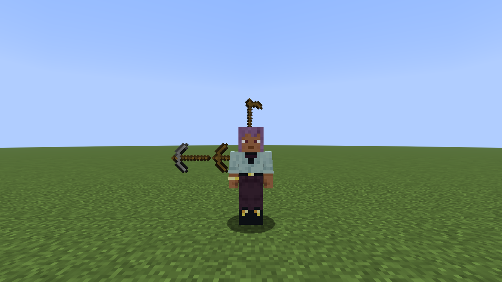
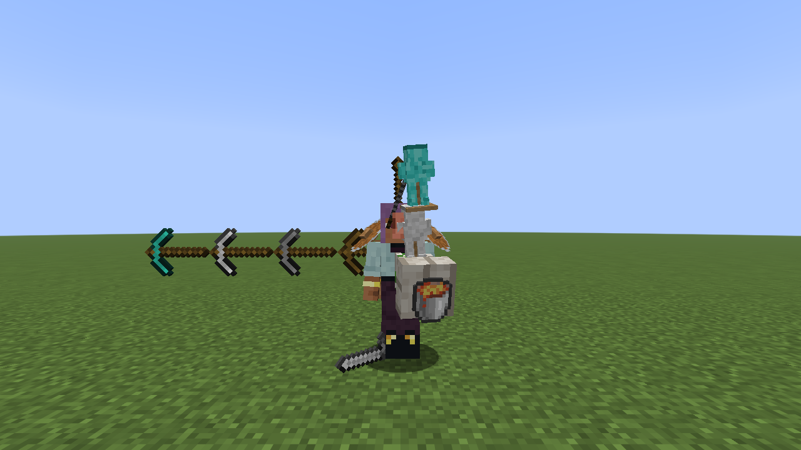
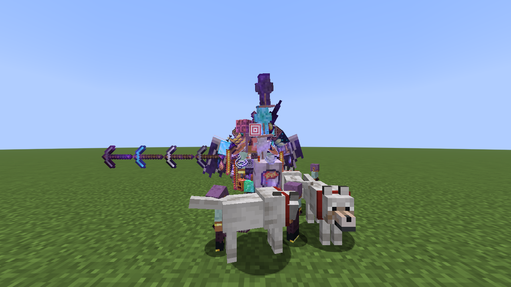
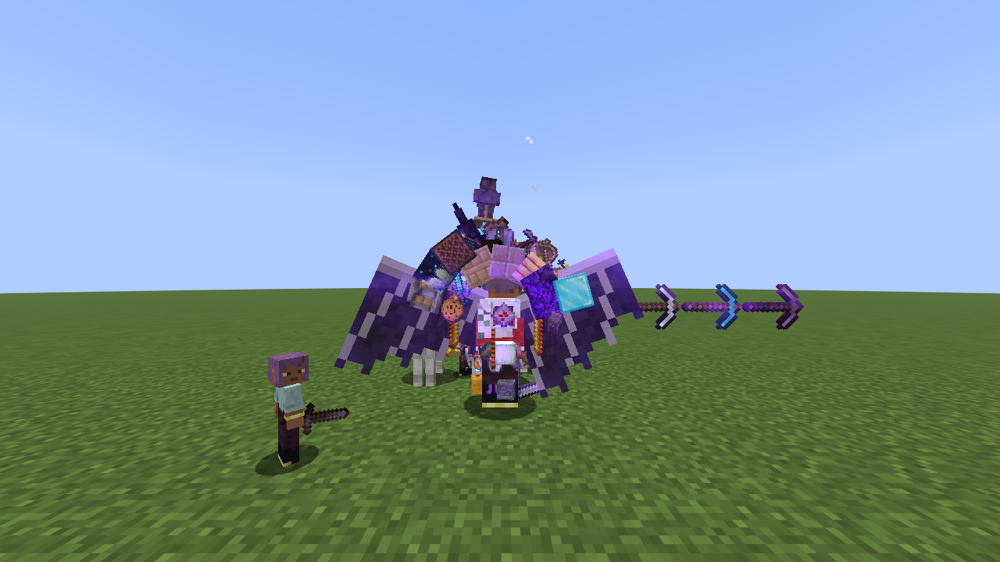

# Body Upgrades — każde osiągnięcie ulepsza twoje ciało

Mod Fabric na **Minecraft 1.21.11** zrobiony na podstawie filmu
[„Minecraft but you can UPGRADE Yourself Infinitely”](https://youtu.be/XcSAHT6EgD8) (Craftee).
Za każde osiągnięcie z filmu dostajesz nową moc, a z ciała wyrasta nowa część: kilofy z ramienia, motyka na głowie,
ramię golema przez klatkę piersiową, łóżko na plecach, skrzydła smoka... Kod, modele i tekstury są autorskie
(tekstury generuje skrypt `tools/make_textures.py`, modele `tools/make_models.py`).

| Początek | Połowa filmu | Wszystko (przód) | Wszystko (tył) |
|---|---|---|---|
|  |  |  |  |

## Instalacja

1. Zainstaluj [Fabric Loader](https://fabricmc.net/use/installer/) dla 1.21.11 (0.17.3 lub nowszy).
2. Wrzuć do folderu `mods`:
   - `upgrades-1.21.11-1.0.0.jar` (ten mod),
   - [Fabric API](https://modrinth.com/mod/fabric-api) dla 1.21.11.
3. Graj normalnie — ulepszenia przychodzą same z osiągnięciami.

Mod musi być **na serwerze i u graczy** (klient rysuje części ciała, klony i obsługuje moce pustą ręką).

## Ulepszenia (w kolejności z filmu)

| Osiągnięcie | Ulepszenie | Co robi | Część ciała |
|---|---|---|---|
| Epoka kamienia | **Pięści-Kilof** | pięść kopie jak drewniany kilof | drewniany kilof z ramienia |
| Lepsze narzędzia | **Vein Miner** | kopiesz całą grupę połączonych takich samych bloków (16); pięść = kamienny kilof | kamienny kilof doczepiony do drewnianego |
| Nasionka | **Zielona Rączka** | PPM pustą ręką na ziemię: zaorywuje 3×3 i od razu sadzi; uprawy wokół ciebie rosną błyskawicznie | motyka na głowie |
| Zdobycz sprzętowa | **Ramię Golema** | +3 obrażeń wręcz, ciosy podrzucają moby | ramię golema przez klatkę |
| Łowca potworów | **Miecz w Bucie** | ciosy wręcz ranią wszystko dookoła (także twoje klony — jak w filmie), sprint w moby rani i odrzuca | miecz z buta |
| Ubierz się | **Klon Bojowy Lv. 1** | gdy potwór cię zrani, pojawia się klon, który odciąga wrogów | żelazna figurka na ramieniu golema |
| Słodkich snów | **Łóżko na Plecach** | kucnij + PPM pustą ręką: rozkładasz duże łóżko i ucinasz drzemkę (o każdej porze); pełna drzemka leczy do pełna | łóżko na plecach |
| Ale okazja! | **Nos Handlarza** | kucnij + PPM pustą ręką: wywąchujesz moba albo blok, który chce handlować (świeci); PPM na nim otwiera oferty. Cena to rzeczy, które masz przy sobie, oferty wygasają po 30 s | nos wieśniaka |
| Cel! | **Spust** | PPM pustą ręką strzela strzałą | łuk na czole |
| Nie dziś, dziękuję | **Mini Tarcze** | pociski są blokowane i odbijane prosto w strzelca | tarcze na barkach |
| Czy to nie żelazny kilof? | **Vein Miner+** | 48 bloków, pięść = żelazny kilof | żelazny kilof w łańcuchu |
| Diamenty! | **Vein Miner++** | 128 bloków, pięść = diamentowy kilof | diamentowy kilof w łańcuchu |
| Okryj mnie diamentami | **Klon Bojowy Lv. 2** | klony walczą za ciebie, mają mało HP i po śmierci dzielą się na dwa mniejsze | diamentowa figurka |
| Gorący towar | **Gorące Łapy** | cios wręcz stawia pod ofiarą lawę, która znika po 4 s | wiadro lawy w pięści golema |
| Wyzwanie z wiadrem lodu | **Obsydianowy Róg** | PPM obsydianem rzuca nim: wybuch + obsydian w kraterze. Kucnij + PPM stawia normalnie | obsydianowy róg |
| Zaklinacz | **Zaklęte Ciało** | dropy z bloków i mobów ×2–×5 (z Vein Minerem = góry przedmiotów) | wszystkie części błyszczą |
| Musimy zejść głębiej | **Portal w Kieszeni** | PPM pustą ręką stawia portal tam, gdzie patrzysz (do 64 bloków); max 2, wejście w jeden wyrzuca z drugiego (też między wymiarami) | portal w kieszeni |
| W ogień | **Moc Blaze'a** | PPM różdżką Blaze'a: salwa 3 kul ognia (różdżka się nie zużywa) | krążące różdżki Blaze'a |
| Ukryte w głębinach | **Vein Miner MAX** | 512 bloków, pięść = netherytowy kilof | netherytowy kilof na końcu łańcucha |
| Okryj mnie gruzem | **Klon Bojowy Lv. 3** | silne klony z netherytowym mieczem, nieśmiertelne | netherytowa figurka |
| Szpiegowskie oko | **Oko Kresu** | przytrzymaj kucanie (stojąc) 2 s: losowy teleport, 35% szans na salę z portalem do Kresu | oko Kresu zamiast oka |
| Koniec? | **Skrzydła Smoka** | latasz; PPM pustą ręką strzela samonaprowadzającymi kulami ognia, które niszczą kryształy Kresu | skrzydła smoka |
| Następne pokolenie | **Następne Pokolenie** | małe klony, które same się mnożą... | smocze jajo na ramieniu |

Po odblokowaniu: napis **NOWE ULEPSZENIE!** z nazwą, dźwięk i opis mocy na czacie (pod komunikatem o osiągnięciu).
Ulepszenia wynikają z osiągnięć, więc działa też `/advancement grant|revoke` i nic nie jest zapisywane w świecie poza ustawieniami.

## Bonusy za wszystkie pozostałe osiągnięcia (96)

Tytuł filmu obiecuje ulepszanie się „w nieskończoność”, więc **każde** osiągnięcie, którego nie było w filmie, też coś daje:
mniejszą moc (statystykę, stały efekt albo specjalną zdolność) i przedmiot z ikony osiągnięcia gdzieś na ciele — w koronie
na głowie, na piersi, w wachlarzu na plecach, u pasa, na rękach, na nogach albo krążący wokół. Test gry sprawdza, że każde
osiągnięcie ogłaszane na czacie daje dokładnie jedno ulepszenie. Wyłączysz je komendą `/upgrades bonuses off`.

Dodatkowo „Taktyczne wędkowanie” daje 24. główne ulepszenie: **Wędka-Ręka** — PPM pustą ręką przyciąga moba, na którego
patrzysz (lewa ręka kończy się wędką).

| Osiągnięcie | Bonus | Co daje | Na ciele |
|---|---|---|---|
| `adventure/adventuring_time` | **Obieżyświat** | **+15% szybkości** chodzenia | diamond_boots — na nogach |
| `adventure/arbalistic` | **Arbalista** | Twoje strzały zadają **+50% obrażeń** | tipped_arrow — wachlarz na plecach |
| `adventure/avoid_vibration` | **Cichy Krok** | **Skradasz się** dużo szybciej | sculk_sensor — na nogach |
| `adventure/blowback` | **Podmuch** | Wybuchy **cię nie odrzucają** | wind_charge — krąży wokół |
| `adventure/brush_armadillo` | **Łuska Pancernika** | **+2 pancerza** | armadillo_scute — na piersi |
| `adventure/bullseye` | **W Dziesiątkę** | Twoje strzały **lecą prosto** (bez opadania) | target — korona na głowie |
| `adventure/craft_decorated_pot_using_only_sherds` | **Garncarz** | **+1 szczęścia** (lepsze łupy) | decorated_pot — u pasa |
| `adventure/crafters_crafting_crafters` | **Automat** | **+10% szybkości kopania** | crafter — wachlarz na plecach |
| `adventure/fall_from_world_height` | **Twarde Lądowanie** | Spadasz **6 bloków więcej** bez obrażeń | water_bucket — na nogach |
| `adventure/heart_transplanter` | **Drugie Serce** | **+2 serca** | creaking_heart — na piersi |
| `adventure/hero_of_the_village` | **Bohater Wioski** | Stały efekt **Bohatera Wioski** (tańszy handel) | emerald_block — u pasa |
| `adventure/honey_block_slide` | **Lepkie Stopy** | **Wchodzisz na bloki** bez skakania | honey_block — na nogach |
| `adventure/kill_all_mobs` | **Łowca Wszystkiego** | **+20% obrażeń** wręcz | diamond_sword — wachlarz na plecach |
| `adventure/kill_mob_near_sculk_catalyst` | **Rozrost** | Zabite moby dają **dodatkowe doświadczenie** | sculk_catalyst — wachlarz na plecach |
| `adventure/lighten_up` | **Świetliste Oczy** | Stałe **widzenie w ciemności** | copper_bulb — korona na głowie |
| `adventure/lightning_rod_with_villager_no_fire` | **Piorunochron** | **Pioruny cię nie ranią** | lightning_rod — korona na głowie |
| `adventure/minecraft_trials_edition` | **Próba Wiatru** | **Skaczesz wyżej** | chiseled_tuff — na nogach |
| `adventure/ol_betsy` | **Stara Betsy** | Łuk na czole strzela **trzema strzałami** naraz | crossbow — na rękach |
| `adventure/overoverkill` | **Miażdżący Cios** | Cios **w locie** zadaje obrażenia jak buzdygan | mace — wachlarz na plecach |
| `adventure/play_jukebox_in_meadows` | **Dźwięk Muzyki** | Powoli **odzyskujesz zdrowie** (przy muzyce) | jukebox — wachlarz na plecach |
| `adventure/read_power_of_chiseled_bookshelf` | **Mól Książkowy** | **+1 zasięgu** do bloków | chiseled_bookshelf — wachlarz na plecach |
| `adventure/revaulting` | **Skarbiec** | **+2 szczęścia** | ominous_trial_key — u pasa |
| `adventure/salvage_sherd` | **Archeolog** | Kopiesz **pod wodą** tak szybko jak na lądzie | brush — na rękach |
| `adventure/sniper_duel` | **Snajper** | Twoje strzały lecą **1,5× szybciej** | arrow — korona na głowie |
| `adventure/spear_many_mobs` | **Włócznik** | **+1 zasięgu** ataku | iron_spear — wachlarz na plecach |
| `adventure/spyglass_at_dragon` | **Sokole Oko** | Potwory w pobliżu **świecą** | spyglass — korona na głowie |
| `adventure/spyglass_at_ghast` | **Czy To Balon?** | **+30% odporności** na odrzut | string — krąży wokół |
| `adventure/spyglass_at_parrot` | **Czy To Ptak?** | Spadasz **4 bloki więcej** bez obrażeń | feather — korona na głowie |
| `adventure/summon_iron_golem` | **Najemnik** | Ciosy **mocniej odrzucają** | carved_pumpkin — u pasa |
| `adventure/throw_trident` | **Trójząb** | **Szybciej pływasz** | trident — wachlarz na plecach |
| `adventure/totem_of_undying` | **Drugie Życie** | Raz na 10 minut **unikasz śmierci** | totem_of_undying — na piersi |
| `adventure/trade_at_world_height` | **Gwiezdny Handlarz** | **+1 serce** | emerald — korona na głowie |
| `adventure/trim_with_all_exclusive_armor_patterns` | **Styl Kowala** | **+2 wytrzymałości** pancerza | silence_armor_trim_smithing_template — na piersi |
| `adventure/trim_with_any_armor_pattern` | **Nowy Wygląd** | **+1 pancerza** | dune_armor_trim_smithing_template — na piersi |
| `adventure/two_birds_one_arrow` | **Dwa Ptaki** | Twoje strzały **przebijają** moby | spectral_arrow — korona na głowie |
| `adventure/under_lock_and_key` | **Pod Kluczem** | **+10% szybkości kopania** | trial_key — u pasa |
| `adventure/use_lodestone` | **Magnes** | **Przyciągasz** przedmioty i doświadczenie | lodestone — na piersi |
| `adventure/very_very_frightening` | **Piorunujący Cios** | Ciosy czasem **przywołują piorun** (ciebie nie rani) | glowstone_dust — krąży wokół |
| `adventure/voluntary_exile` | **Wygnaniec** | **+1 obrażeń** wręcz | ominous_bottle — u pasa |
| `adventure/walk_on_powder_snow_with_leather_boots` | **Lekki Jak Królik** | **Skaczesz wyżej** | leather_boots — na nogach |
| `adventure/who_needs_rockets` | **Podwójny Skok** | **Skok w powietrzu** (drugi skok) | firework_rocket — na nogach |
| `adventure/whos_the_pillager_now` | **Kto Tu Łupi?** | **+15% szybkości** ataku | iron_axe — na rękach |
| `end/dragon_breath` | **Smoczy Oddech** | Kto cię uderzy, **dostaje Obumarcie** | dragon_breath — korona na głowie |
| `end/elytra` | **Niebo To Granica** | **Brak obrażeń od upadku** | elytra — wachlarz na plecach |
| `end/enter_end_gateway` | **Ucieczka** | Przy niskim zdrowiu **teleportujesz się** w bezpieczne miejsce | ender_pearl — krąży wokół |
| `end/find_end_city` | **Miasto Kresu** | **+2 pancerza** | purpur_block — wachlarz na plecach |
| `end/kill_dragon` | **Pogromca Smoka** | **+2 serca** | dragon_head — korona na głowie |
| `end/levitate` | **Lewitacja** | **Kucnij w powietrzu** — powoli opadasz | shulker_shell — krąży wokół |
| `end/respawn_dragon` | **Znowu Koniec** | **+2 obrażeń** wręcz | end_crystal — krąży wokół |
| `husbandry/allay_deliver_cake_to_note_block` | **Urodziny** | **Wolniej głodniejesz** | cake — u pasa |
| `husbandry/allay_deliver_item_to_player` | **Przyjaciel Allaya** | **+10% szybkości** chodzenia | cookie — krąży wokół |
| `husbandry/axolotl_in_a_bucket` | **Aksolotl** | **Oddychasz pod wodą** | axolotl_bucket — u pasa |
| `husbandry/balanced_diet` | **Zbilansowana Dieta** | **Nie odczuwasz głodu** | apple — korona na głowie |
| `husbandry/bred_all_animals` | **Dwoje z Każdego** | Zwierzęta, które rozmnażasz, mają **bliźniaki** | golden_carrot — u pasa |
| `husbandry/breed_an_animal` | **Hodowca** | **Nie zwalniasz** na piasku dusz i miodzie | wheat — u pasa |
| `husbandry/complete_catalogue` | **Kocia Ekipa** | **Creepery nie wybuchają** przy tobie | cod — u pasa |
| `husbandry/feed_snifflet` | **Mały Węszyciel** | **Czujesz rudy** w pobliżu (świecą przez ściany) | torchflower_seeds — korona na głowie |
| `husbandry/fishy_business` | **Rybka** | **+1 szczęścia** | salmon — u pasa |
| `husbandry/froglights` | **Żabie Moce** | **+1 serce** | verdant_froglight — u pasa |
| `husbandry/kill_axolotl_target` | **Moc Przyjaźni** | **Leczysz się** w wodzie | tropical_fish_bucket — u pasa |
| `husbandry/leash_all_frog_variants` | **Żabia Ekipa** | **+10% szybkości** ataku | lead — na rękach |
| `husbandry/make_a_sign_glow` | **Świecący Tusz** | **Dłużej wytrzymujesz** pod wodą | glow_ink_sac — korona na głowie |
| `husbandry/obtain_netherite_hoe` | **Poważne Oddanie** | Zielona Rączka orze **5×5** i działa dalej | netherite_hoe — wachlarz na plecach |
| `husbandry/obtain_sniffer_egg` | **Ciekawy Zapach** | **+1 szczęścia** | sniffer_egg — u pasa |
| `husbandry/place_dried_ghast_in_water` | **Nawodnij Się** | Stała **Gracja Delfina** | dried_ghast — wachlarz na plecach |
| `husbandry/plant_any_sniffer_seed` | **Sadząc Przeszłość** | **+1 serce** | pitcher_pod — korona na głowie |
| `husbandry/remove_wolf_armor` | **Nożyce** | **+10% szybkości kopania** | shears — na rękach |
| `husbandry/repair_wolf_armor` | **Jak Nowy** | Narzędzia i zbroja **same się naprawiają** | wolf_armor — na piersi |
| `husbandry/ride_a_boat_with_a_goat` | **Kozia Łódka** | Spadasz **3 bloki więcej** bez obrażeń | oak_boat — wachlarz na plecach |
| `husbandry/safely_harvest_honey` | **Żądło** | Ciosy **zatruwają** | honey_bottle — u pasa |
| `husbandry/silk_touch_nest` | **Delikatne Dłonie** | **Kucnij i kop pustą ręką** — jedwabny dotyk | bee_nest — wachlarz na plecach |
| `husbandry/tadpole_in_a_bucket` | **Kijanka** | **Szybciej pływasz** | tadpole_bucket — u pasa |
| `husbandry/tame_an_animal` | **Najlepszy Przyjaciel** | Masz **oswojonego wilka**, który zawsze wraca | name_tag — u pasa |
| `husbandry/wax_off` | **Zdrapywacz** | Pięści **rąbią jak siekiera** | stone_axe — na rękach |
| `husbandry/wax_on` | **Woskowanie** | **+20% odporności** na odrzut | honeycomb — na piersi |
| `husbandry/whole_pack` | **Cała Wataha** | Masz **3 wilki** zamiast jednego | bone — u pasa |
| `nether/all_effects` | **Jak Tu Trafiliśmy?** | **Złe efekty** od razu znikają | milk_bucket — u pasa |
| `nether/all_potions` | **Wściekły Koktajl** | Stały **Pośpiech** | potion — u pasa |
| `nether/brew_potion` | **Lokalny Browar** | **+1 obrażeń** wręcz | brewing_stand — wachlarz na plecach |
| `nether/charge_respawn_anchor` | **Prawie Dziewięć Żyć** | **+1 serce** | respawn_anchor — wachlarz na plecach |
| `nether/create_beacon` | **Latarnia** | Ty, twoje klony i wilki macie **Regenerację** | beacon — korona na głowie |
| `nether/create_full_beacon` | **Latarnik** | Aura latarni daje też **Siłę** | diamond_block — wachlarz na plecach |
| `nether/distract_piglin` | **Błyskotki** | **Pigliny cię nie atakują** | gold_ingot — u pasa |
| `nether/explore_nether` | **Gorąca Turystyka** | **+10% szybkości** chodzenia | netherite_boots — na nogach |
| `nether/fast_travel` | **Podprzestrzenny Bąbel** | **+10% szybkości** chodzenia | map — krąży wokół |
| `nether/find_bastion` | **Dawne Czasy** | **+1 pancerza** | polished_blackstone_bricks — na piersi |
| `nether/find_fortress` | **Straszliwa Forteca** | **Odporność na ogień** | magma_cream — korona na głowie |
| `nether/get_wither_skull` | **Upiorna Czaszka** | Ciosy nakładają **Obumarcie** | wither_skeleton_skull — korona na głowie |
| `nether/loot_bastion` | **Świnie Wojenne** | **+1 wytrzymałości** pancerza | gold_block — u pasa |
| `nether/obtain_crying_obsidian` | **Kto Kroi Cebulę?** | **+1 serce** | crying_obsidian — wachlarz na plecach |
| `nether/return_to_sender` | **Zwrot do Nadawcy** | Ciosy **podpalają** | fire_charge — krąży wokół |
| `nether/ride_strider` | **Łódź z Nogami** | **Krócej się palisz** | warped_fungus_on_a_stick — na rękach |
| `nether/ride_strider_in_overworld_lava` | **Jak w Domu** | **+1 serce** | warped_fungus — u pasa |
| `nether/summon_wither` | **Dziki Tłum** | **Obumarcie cię nie rusza** | nether_star — korona na głowie |
| `nether/uneasy_alliance` | **Niełatwy Sojusz** | **Ghasty cię nie atakują** | ghast_tear — krąży wokół |
| `story/cure_zombie_villager` | **Doktor Zombie** | **+2 serca** | golden_apple — u pasa |

## Sterowanie

- **PPM pustą ręką** — moc „kliknięcia” (Zielona Rączka / Spust / Portal / Skrzydła Smoka).
- **Kucnij + PPM pustą ręką** — moc „kucania” (Drzemka / Nos Handlarza).
- **V** — zmienia moc pod PPM, **kucnij + V** — pod kucnij + PPM. Nowa moc wybiera się sama po odblokowaniu
  (jak w filmie: zawsze używasz najnowszej). Z pustą ręką nad paskiem szybkiego wyboru widać, co jest wybrane.
- **Kucanie przy kopaniu** — kopie pojedynczy blok (bez Vein Minera).

## Komendy (`/upgrades`)

| Komenda | Co robi |
|---|---|
| `/upgrades` / `/upgrades list [gracz]` | lista ulepszeń gracza |
| `/upgrades bonuses [gracz]` | lista bonusów (najedź myszką na nazwę, żeby zobaczyć opis) |
| `/upgrades bonuses on` / `off` | bonusy za pozostałe osiągnięcia (domyślnie WŁ) |
| `/upgrades give <gracze> <ulepszenie\|bonus\|all\|main\|bonus>` | nadaje ulepszenie (zalicza jego osiągnięcie); `main` = z filmu, `bonus` = wszystkie bonusy |
| `/upgrades take <gracze> <ulepszenie\|all\|main\|bonus>` | zabiera (cofa osiągnięcie) |
| `/upgrades on` / `off` | włącza / wyłącza wszystkie ulepszenia |
| `/upgrades enable\|disable <ulepszenie\|all>` | włącza / wyłącza pojedyncze ulepszenie |
| `/upgrades powers select` | jedna moc na przycisk, V zmienia (domyślne) |
| `/upgrades powers all` | wszystkie moce na przycisku odpalają naraz |
| `/upgrades titles true\|false` | napis NOWE ULEPSZENIE |
| `/upgrades veinminer sneak true\|false` | czy kucanie kopie pojedynczy blok |
| `/upgrades veinminer sizes <lv1> <lv2> <lv3> <max>` | ile bloków kopie Vein Miner (domyślnie 16 48 128 512) |
| `/upgrades drops <min> <max>` | mnożnik dropów Zaklętego Ciała (domyślnie 2–5) |
| `/upgrades clones max <n>` | maks. klonów bojowych na gracza (domyślnie 40) |
| `/upgrades clones multiplicity <n>` | maks. klonów z Następnego Pokolenia (domyślnie 150) |
| `/upgrades clones clear [gracz]` | usuwa klony |
| `/upgrades portals clear` | usuwa portale |
| `/upgrades settings` / `reset` | pokazuje / przywraca ustawienia |

Ustawienia zapisują się w folderze świata (`upgrades.json`).

## Co zmieniłem względem filmu (i dlaczego)

- **Jedna moc na przycisk + klawisz V.** W filmie Portal, Spust i Skrzydła są na tym samym PPM pustą ręką, a Drzemka
  i Nos na kucnij + PPM. Gdyby wszystko odpalało naraz, każde wywąchanie handlu kładłoby cię spać, a każdy strzał
  przestawiałby portal. Domyślnie działa najnowsza moc (tak to wyglądało w filmie), a „wszystko naraz” jest pod
  `/upgrades powers all`.
- **Limit klonów.** W filmie Następne Pokolenie mnożyło się bez końca i „zepsuło świat” — tu jest limit (150,
  do zmiany komendą), a `/upgrades clones clear` sprząta.
- **Kucanie = pojedynczy blok** przy kopaniu i **teleport Oka Kresu tylko na stojąco** — żeby nie rozkopać bazy ani
  nie teleportować się przy budowaniu na kucaka. Oba da się wyłączyć (`/upgrades veinminer sneak false`).
- **Obsydian stawiasz na kucaka** — w filmie po ulepszeniu nie dało się go postawić.
- Klony mają **twoją skórkę** (skórkę gracza, który je przywołał).

## Propozycje na później

- Portale zapisywane w świecie (teraz znikają po restarcie serwera).
- Ekran z drzewkiem ulepszeń pod klawiszem.

## Budowanie

```
./gradlew build                 # mod + testy serwerowe
./gradlew runClientGameTest     # prawdziwy klient, zrzuty ekranu w build/run/clientGameTest/screenshots
```
